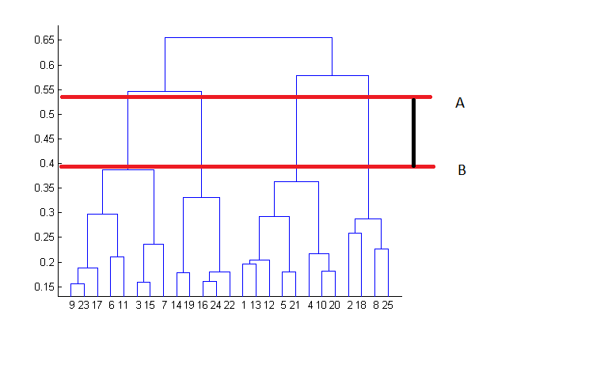

Hierarchical Clustering
========================================================
author: Stephanie Duncan  
date: 15/02/2021

What is Hierarchical Clustering?
========================================================

Hierarchical clustering is a form of unsupervised learning, where a machine learning algorithm is trained without having the answer to the problem. Hierarchical clustering algorithms build a hierarchy of clustered data points to form a connectivity model. 

Two types:

- Agglomerative - each data point starts in it's own cluster, and pairs of clusters are merged as one moves up the hierarchy.

- Divisive - the observations begin in one cluster, and splits are performed recursively as one moves down the hierarchy.

How does Hierarchical Clustering Work?
========================================================

The algorithm starts off with all data points assigned to a cluster of their own. Then the algorithm works to minimise the number of clusters by merging those closest to each other using a distance measurement such as:

- Hamming distance for text 
- Euclidean distance for numeric clusters 

Dendrogram 
========================================================

### Agglomerative Example
#### "Bottom-Up" Approach

In this example, interpretation of the dendrogram shows that the best choice of clusters is four, as the red lines indicate the maximum vertical distance covered between A and B.

Image from:- [analyticsvidhya.com](https://www.analyticsvidhya.com/blog/2016/11/an-introduction-to-clustering-and-different-methods-of-clustering/)

Advantages of Hierarchical Clustering
========================================================

- Able to identify clusters with no prior knowledge of the data structure.

- The number of clusters to be generated is not required to be specified beforehand.

Disadvantages of Hierarchical Clustering
========================================================

This algorithm does not handle big data well as the time complexity of hierarchical clustering is quadratic i.e. O(n2). The algorithm calculates the distance between all possible combinations before making one decision to combine two groups/individual data-points, which is time consuming.

Areas of Application
========================================================

- Recommendation engines
- Market segmentation
- Social network analysis e.g fake news
- Search result grouping
- Medical imaging
- Image segmentation
- Anomaly detection

Sources:

- https://www.analyticsvidhya.com/blog/2016/11/an-introduction-to-clustering-and-different-methods-of-clustering/

- https://www.youtube.com/watch?v=7xHsRkOdVwo

- https://www.analyticsvidhya.com/blog/2019/05/beginners-guide-hierarchical-clustering/